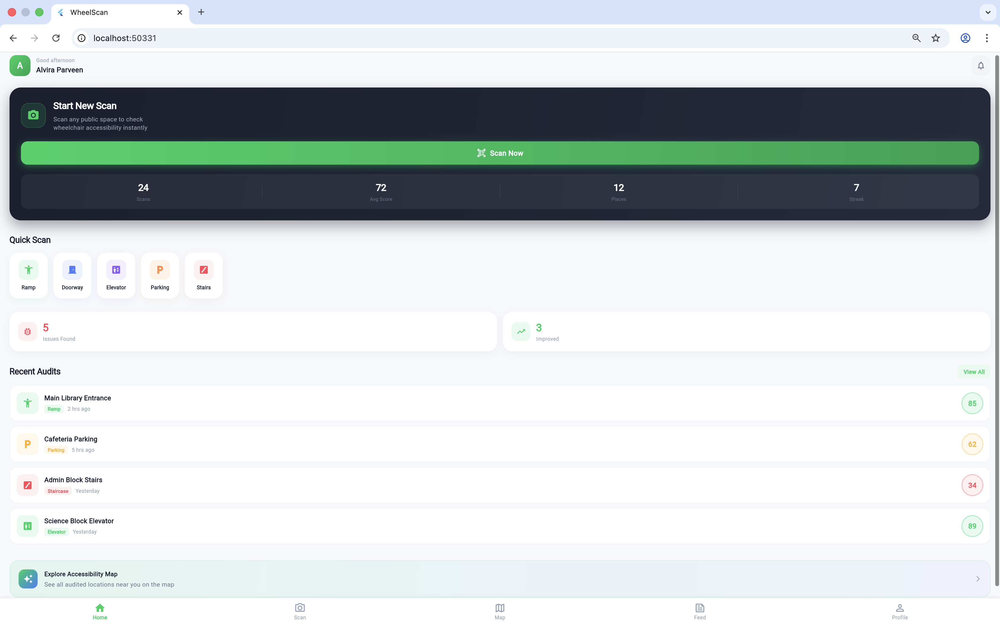
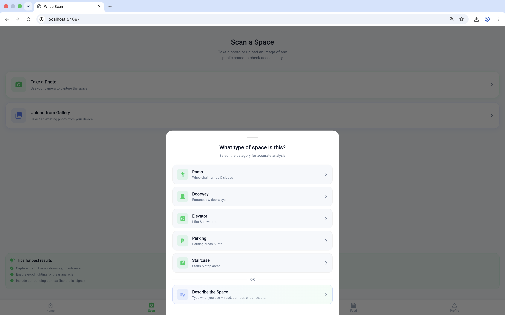
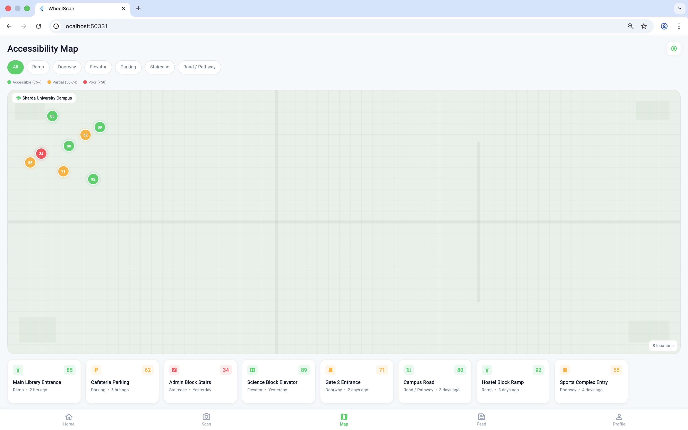
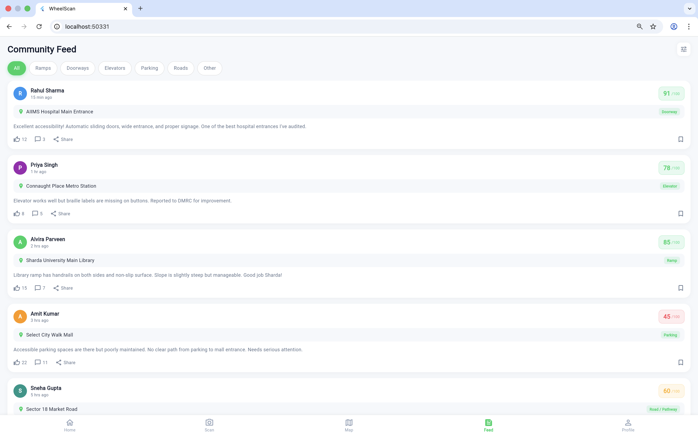
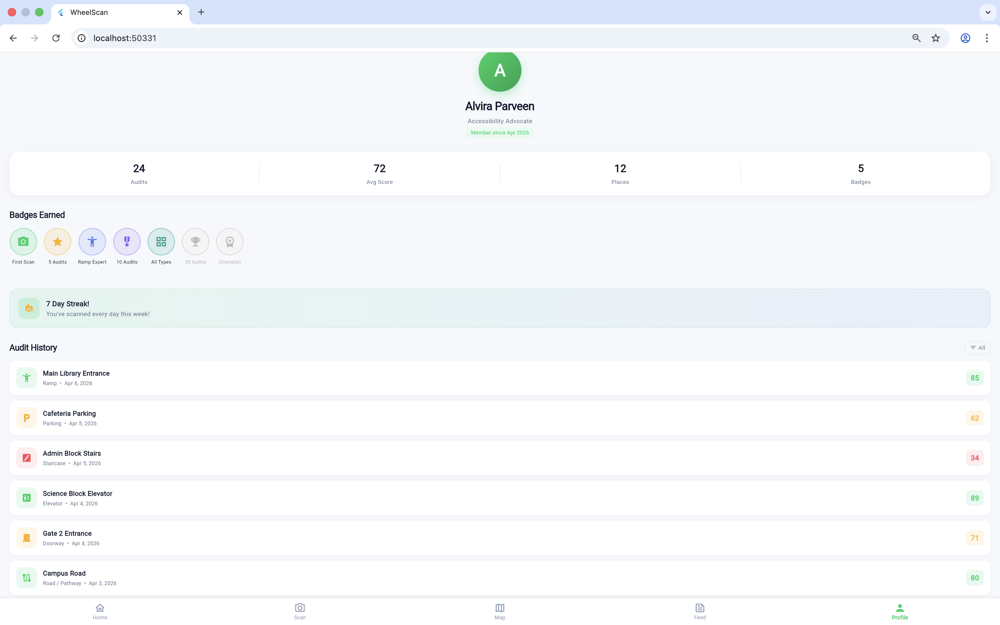
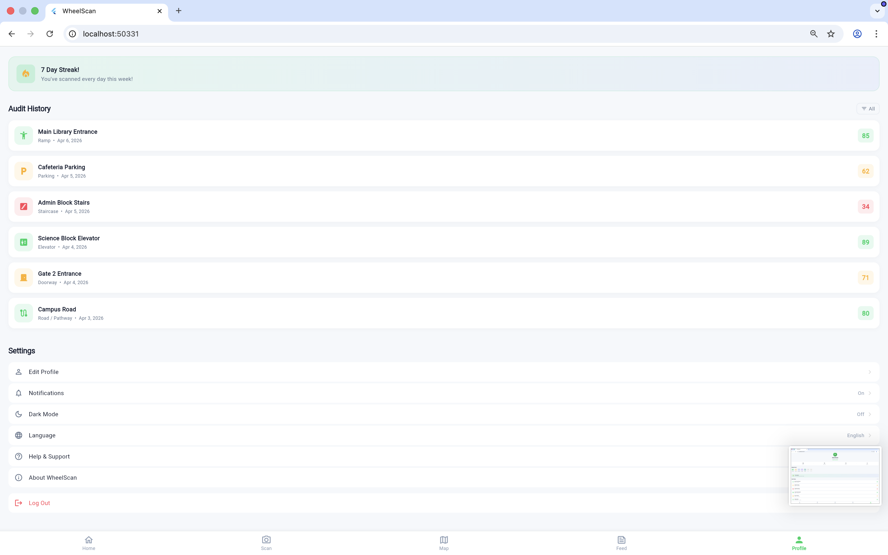

# 🚀 WheelScan - AI-Powered Accessibility Auditor for Public Spaces

WheelScan is a Flutter mobile app that lets anyone scan public spaces (ramps, doorways, elevators, parking lots, staircases, roads, and more) and get instant accessibility scores out of 100 with detailed pass/warning/critical breakdown & recommendations **and now a prioritized, AI-generated action plan telling you exactly what to fix, why it matters, and how to verify the fix.**

> **Score without guidance is just a number. WheelScan turns it into a plan.**


---

🔗 **Live Demo :** [wheelscan-app-d6180.web.app](https://wheelscan-app-d6180.web.app)
🔗 **Demo video :** [add link once recorded]
🔗 **Project Description doc :** [Project Description](https://docs.google.com/document/d/1p6nU_qT-5uHVekM_Dzo9nED4xrYCIY92Wtrc1w2t0zg/edit?usp=sharing)

--- 

## 📸 Screenshots

### Dashboard


### Input Section


### Map


### Community Feed


### Profile


### FAQ  



---

## 🎯 Problem Solved

👉 WheelScan makes accessibility instant, scalable, and community-driven & solves a real-world accessibility gap :

- There's no easy way to check if a place is accessible before visiting it. 
- Manual accessibility audits are expensive and rare, so people with disabilities often discover barriers only after they've arrived — a staircase with no ramp, a doorway too narrow for a wheelchair, missing handrails or tactile warnings.

WheelScan already let anyone score a space instantly from a photo. But a raw score doesn't tell you *what's* wrong or *how* to fix it — until now.

---

## 📌 What It Does/Key Features

**1. 📸 Scan any space** - Take a photo or upload from gallery. Choose a preset category (Ramp, Doorway, Elevator, Parking, Staircase) or describe the space in your own words — 12+ space types supported.

**2. 🧠 Get an instant score** - A rule-based scoring engine rates each accessibility criterion GOOD / WARNING / CRITICAL and produces a score out of 100.

**3. 📊 Get an AI Action Plan** -  For every flagged issue, an AI agent generates:
- **Why it matters** — plain-language explanation of the real-world impact
- **Recommended fix** — specific, standards-based advice (not generic)
- **Standard reference** — the accessibility guideline behind the recommendation
- **Priority rank** — which fix matters most for independent access
- **Impact label** — e.g. `High access impact` / `High safety impact`
- **Effort label** — e.g. `High effort` / `Medium effort`
- **Cost tag** — e.g. `Low cost — DIY` / `Medium — needs contractor` / `High — structural change`
- **Confidence flag** — `High confidence` vs `Verify on-site`, so the agent never overstates certainty
- **How to verify** — the exact post-fix check to confirm the issue is resolved
- **Agent self-check** — a visible note confirming the recommendation was reviewed for actionability before being shown (e.g. *"Draft generated from CRITICAL criterion and checked for actionability"*)

**4. 🏆  Copy a shareable report** - One tap copies the full action plan as clean, readable text — ready to paste into WhatsApp, email, or a maintenance request.

**5. 👥 Explore the community Feed & Accessibility Map** - View all audited locations on an interactive map, browse a community feed of other users' audits, and track your own audit history with badges and streaks.

---

## ✨ Tech Stack

| Technology | Purpose |
|---|---|
| Flutter 3.38 | Cross-platform UI framework |
| Dart 3.10 | Programming language |
| OpenAI Codex | Agentic build partner — planning, generation, self-review of the Recommendation Agent |
| image_picker | Camera and gallery access |
| CustomPainter | Score ring animation and map |
| AnimationController | Splash, score, card, and agent-reasoning-trace animations |
| Material Design 3 | UI components and theming |

---

## 🧠 How Codex Was Used

This project was built primarily with **OpenAI Codex**, used as a genuine agentic collaborator, not autocomplete :

1. **Planned** the AI Action Plan feature — data structure, UI flow, and agent prompt design — before writing code
2. **Generated** the recommendation agent logic, connecting it to the existing scoring engine's output without modifying the scorer itself
3. **Self-reviewed** its own output at each stage — flagging vague recommendations for rewrite, and adding the visible "agent self-check" line so the reasoning process is transparent to the end user, not just the final result
4. **Iterated** across multiple rounds — first shipping the core AI Action Plan, then a second pass adding impact/effort/cost/confidence tags and the visible reasoning trace, based on direct feedback

We treated Codex's own review workflow as our own quality bar: failing-test-first logic, read-only review passes, and demanding evidence (file:line, standard reference) before accepting any generated recommendation as final.

---

## 📂 Project Structure

```
lib/
├── main.dart                    # App entry point and navigation
├── config/
│   └── theme.dart               # Colors, gradients, text styles
├── models/
│   └── audit_model.dart         # AuditResult, AuditIssue, and Recommendation classes
├── screens/
│   ├── splash_screen.dart       # Animated intro screen
│   ├── home_screen.dart         # Dashboard with stats and quick scan
│   ├── scan_screen.dart         # Image capture and space type selector
│   ├── result_screen.dart       # Score ring, breakdown, and AI Action Plan
│   ├── map_screen.dart          # Interactive accessibility map
│   ├── feed_screen.dart         # Community audit feed
│   └── profile_screen.dart      # User profile, badges, settings
├── services/
│   ├── scoring_service.dart     # Rule-based scoring engine (12+ categories) — unchanged
│   └── recommendation_agent.dart # AI Action Plan generation — plan, draft, self-check
└── widgets/
    └── score_gauge.dart         # Reusable score display widget
```
---

## ⭐ AI Scoring Engine

WheelScan uses a keyword-based scoring engine that supports 12+ space categories:

**Preset Categories:** Ramp, Doorway, Elevator, Parking, Staircase

**Custom Categories (via text input):** Road/Pathway, Home/Residential, Hospital/Medical, Mall/Commercial, Transit/Bus Stop, Garden/Outdoor, Office/Building, and a generic fallback

Each category has specific accessibility criteria. Every criterion is rated:
- **GOOD** = 30 points (meets accessibility standards)
- **WARNING** = 15 points (needs improvement)
- **CRITICAL** = 0 points (fails standards)

**Score Formula:** (Total Points Earned / Maximum Possible Points) x 100

---

## 🧠 How to Run

1. Make sure Flutter is installed (run flutter doctor)
2. Clone this repository
3. Navigate to the project folder
4. Run flutter pub get to install dependencies
5. Run flutter run to start the app

```bash
flutter doctor          # confirm Flutter is installed correctly
git clone <this-repo>
cd WheelScan
flutter pub get
flutter run -d chrome   # or your preferred device
```

---

##  📊 Flutter Concepts Used

StatefulWidget and StatelessWidget, setState for reactive UI, Navigator push and pop, async/await, CustomPainter for canvas drawing, AnimationController with CurvedAnimation, BottomSheet and AlertDialog, GestureDetector, SingleChildScrollView, ListView.builder, and image_picker package.

---

## 🔮 Future Scope

- **Real computer vision** — train a MobileNetV2/TFLite model for actual image-based issue detection (the current AI Action Plan works from the existing rule-based scoring output, not live image understanding — stated here transparently)
- Firebase backend — authentication, Firestore, cloud storage
- Google Maps SDK — real GPS-based map
- PDF export of the full audit + action plan
- Voice input and multi-language support (Hindi, Spanish, French, Arabic)
- Aggregate insight across community audits (e.g. "most common critical issue in this area")

---

## 👤 Author

**Name**: ALVIRA PARVEEN  
🔗 [LinkedIn](https://www.linkedin.com/in/alvira-parveen-78022536b)  
🌐 [GitHub](https://github.com/Alvira-Parveen)

---

## 📄 License

This project is licensed under the MIT License — see the [LICENSE](LICENSE) file for details.

